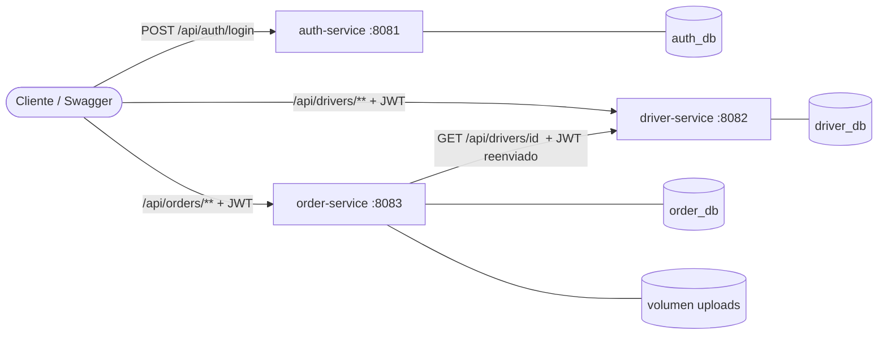

# Transport Platform – Microservicios de gestión de órdenes de transporte

Solución al examen técnico *Desarrollador Backend SR (Java / Spring Boot)* con **arquitectura de microservicios**.

**Stack:** Java 17 · Spring Boot 3.4 · Spring Data JPA · PostgreSQL 16 · Flyway · Spring Security + JWT · MapStruct · springdoc-openapi · JUnit 5 + Mockito · Docker Compose.

## Arquitectura



| Servicio | Puerto | Responsabilidad | Base de datos |
|---|---|---|---|
| `auth-service` | 8081 | Registro, login y emisión de JWT | `auth_db` |
| `driver-service` | 8082 | Alta y consulta de conductores | `driver_db` |
| `order-service` | 8083 | Órdenes, asignaciones y adjuntos (PDF/imagen) | `order_db` + volumen |

Los tres corren en un único contenedor de PostgreSQL con **una base de datos por servicio** (ningún servicio lee tablas de otro).

### Decisiones clave
- **Límites por dominio.** Las órdenes y su asignación cambian juntas (una asignación solo existe dentro del ciclo de vida de una orden), por eso viven en el mismo servicio. Conductores e identidad tienen ciclo de vida propio.
- **Comunicación síncrona REST** de `order-service` → `driver-service` al asignar, para validar que el conductor existe y está activo. La llamada se hace *después* de las validaciones locales para no gastar red si la orden ya es inválida. Timeout configurable (`DRIVER_SERVICE_TIMEOUT_MS`, 3 s).
- **Sin FK entre servicios.** `assignments` guarda `driver_id` y un *snapshot* del nombre del conductor; así consultar una asignación no depende de que `driver-service` esté arriba.
- **Puerto/adaptador.** `order-service` depende de la interfaz `DriverClient`; `RestDriverClient` es un adaptador reemplazable (gRPC, mensajería…) y facilita las pruebas.
- **Fallos de dependencias.** Si `driver-service` cae o expira el timeout → `503 Service Unavailable` con mensaje controlado (no un 500 genérico). Un conductor inexistente → `404`.
- **Seguridad.** `auth-service` firma JWT (HS256); `driver-service` y `order-service` solo **validan** con el mismo secreto (`JWT_SECRET`). El token del usuario se **reenvía** en la llamada entre servicios y también el `X-Request-Id`, de modo que una petición se puede rastrear en los logs de los tres servicios.
- **Flyway** por servicio (`ddl-auto=none`), **logging JSON** nativo de Spring Boot 3.4 con `requestId`, manejo de errores centralizado con `@RestControllerAdvice`, DTOs como `record` validados con Bean Validation, MapStruct para el mapeo.
- **Código común duplicado a propósito** (manejo de errores, filtro de logging, JWT): evita acoplar los servicios por una librería compartida. En un entorno real se extraería a un *starter* interno versionado.

## Cómo ejecutarlo

Requisitos: Docker y Docker Compose.

```bash
docker compose up --build
```

> Si ya habías levantado la base de datos antes, ejecuta `docker compose down -v` primero: el script que crea las tres bases solo corre en un volumen nuevo.

Swagger UI de cada servicio:
- http://localhost:8081/swagger-ui.html (auth)
- http://localhost:8082/swagger-ui.html (drivers)
- http://localhost:8083/swagger-ui.html (orders)

En Swagger: obtener el token con `POST /api/auth/login` → botón **Authorize** → pegar el token (sirve para los tres servicios).

### Flujo de prueba con curl
```bash
# 1. Token
TOKEN=$(curl -s -X POST localhost:8081/api/auth/register -H 'Content-Type: application/json' \
  -d '{"username":"admin","password":"Admin12345"}' | jq -r .accessToken)
AUTH="Authorization: Bearer $TOKEN"; JSON='Content-Type: application/json'

# 2. Conductor (driver-service)
DRIVER=$(curl -s -X POST localhost:8082/api/drivers -H "$AUTH" -H "$JSON" \
  -d '{"name":"Juan Pérez","licenseNumber":"LIC-001"}' | jq -r .id)

# 3. Orden (order-service)
ORDER=$(curl -s -X POST localhost:8083/api/orders -H "$AUTH" -H "$JSON" \
  -d '{"origin":"Monterrey","destination":"CDMX"}' | jq -r .id)

# 4. Asignar (order-service consulta a driver-service internamente)
curl -X POST localhost:8083/api/orders/$ORDER/assignment -H "$AUTH" -H "$JSON" -d "{\"driverId\":\"$DRIVER\"}"

# 5. Adjuntos
curl -X POST localhost:8083/api/orders/$ORDER/assignment/documents -H "$AUTH" -F file=@carta.pdf
curl -X POST localhost:8083/api/orders/$ORDER/assignment/images    -H "$AUTH" -F file=@foto.jpg

# 6. Cambiar estado y listar con filtros
curl -X PATCH localhost:8083/api/orders/$ORDER/status -H "$AUTH" -H "$JSON" -d '{"status":"IN_TRANSIT"}'
curl "localhost:8083/api/orders?status=IN_TRANSIT&origin=monter&from=2025-01-01" -H "$AUTH"
```

### Ejecución local (sin Docker para las apps)
```bash
docker compose up -d db
cd auth-service   && mvn spring-boot:run   # 8081
cd driver-service && mvn spring-boot:run   # 8082
cd order-service  && mvn spring-boot:run   # 8083
```
Todos los valores tienen defaults para desarrollo (`DB_URL`, `DB_USER`, `DB_PASSWORD`, `JWT_SECRET`, `DRIVER_SERVICE_URL`, `STORAGE_LOCATION`…). **`JWT_SECRET` debe ser idéntico en los tres servicios** y de al menos 32 caracteres.

### Pruebas unitarias
```bash
cd auth-service && mvn test && cd ../driver-service && mvn test && cd ../order-service && mvn test
```

## Endpoints

**auth-service** – `POST /api/auth/register`, `POST /api/auth/login` (públicos, devuelven JWT).

**driver-service**
| Método | Ruta | Descripción |
|---|---|---|
| POST | `/api/drivers` | Crear conductor (`active` opcional, por defecto `true`) |
| GET | `/api/drivers/active` | Listar conductores activos |
| GET | `/api/drivers/{id}` | Consultar conductor (lo usa `order-service`) |

**order-service**
| Método | Ruta | Descripción |
|---|---|---|
| POST | `/api/orders` | Crear orden (`CREATED`) |
| GET | `/api/orders/{id}` | Consultar por ID |
| PATCH | `/api/orders/{id}/status` | Cambiar estado (valida el flujo) |
| GET | `/api/orders?status=&from=&to=&origin=&destination=&page=&size=` | Listado filtrado y paginado |
| POST | `/api/orders/{id}/assignment` | Asignar conductor |
| GET | `/api/orders/{id}/assignment` | Ver asignación y adjuntos |
| POST | `/api/orders/{id}/assignment/documents` | Adjuntar PDF (`multipart`, campo `file`) |
| POST | `/api/orders/{id}/assignment/images` | Adjuntar imagen `.png/.jpg` |

## Reglas de negocio
```
CREATED ──► IN_TRANSIT ──► DELIVERED
   │            │
   └──► CANCELLED ◄──┘       (DELIVERED y CANCELLED son finales)
```
- **Asignación:** solo con orden en `CREATED` y conductor `active`; una orden admite una sola asignación.
- **Adjuntos:** se valida extensión **y** contenido real (magic bytes); máx. 5 MB; el nombre en disco lo genera el servidor.
- Filtros de fecha (`yyyy-MM-dd`) sobre `createdAt`, UTC, ambos extremos inclusivos.

## Errores (formato uniforme en los tres servicios)
```json
{ "timestamp": "...", "status": 409, "error": "Conflict",
  "message": "Driver 3f2… is not active", "path": "/api/orders/…/assignment", "details": [] }
```
`400` validación · `401` token ausente/ inválido · `404` no existe · `409` regla de negocio/duplicado · `413` archivo grande · `503` dependencia caída · `500` inesperado.

## Limitaciones conocidas y siguientes pasos
- **Sin API Gateway:** cada servicio se expone en su puerto. Siguiente paso natural: Spring Cloud Gateway como punto de entrada único.
- **Sin circuit breaker/retry** en la llamada a `driver-service` (solo timeout): añadir Resilience4j.
- **Secreto JWT compartido (HS256):** en producción, RS256 con clave pública/JWKS para que los servicios no puedan emitir tokens.
- **Archivos en disco local:** para varias réplicas de `order-service` usar almacenamiento de objetos (S3/MinIO); ya está abstraído en `FileStorageService`.
- **Consistencia:** el nombre del conductor guardado en la asignación es un *snapshot*; no se actualiza si el conductor cambia después.
- **Sin pruebas de integración** (Testcontainers / contract tests con Pact entre servicios).
- Roles/permisos, refresh tokens, endpoint de descarga de adjuntos, CI con GitHub Actions.
